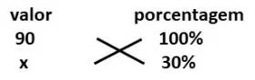
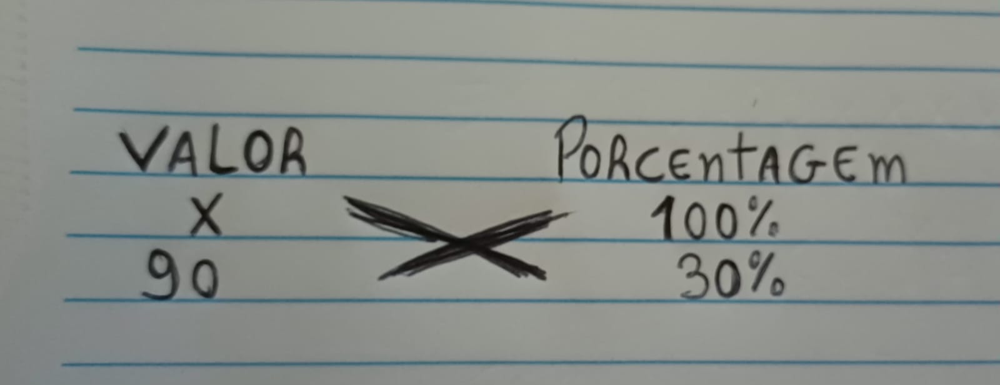
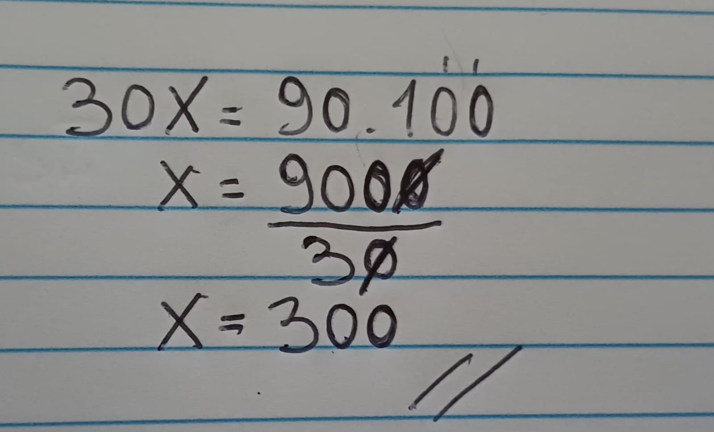

# Matemática Básica
Plano de estudo para vestibular. Neste repositório, vamos aprender os conteúdos que mais caem nas provas. 

Vamos ver: 
* Porcentagem; 
* Regra de três (simples e composta);
* Razão e proporção;
* Frações; 
* Potenciação e Radiciação;
* Conversão de unidades. 

# AULA 1 - PORCENTAGEM

A porcentagem representa uma fração cujo o denominador é igual a 100. O valor da fração pode ser expresso na forma centesimal (denominador igual a 100) ou como um número decimal. 

**Exemplo:**

50% = 50/100 = 0,50

|Porcentagem|Número centesimal|Número decimal| 
|:----------|:-----:          |-----:        |
|50%        |50/100           |0,50          |

# COMO CALCULAR A PORCENTAGEM 

Temos diversas formas de solucionar para calcular a porcentagem. Abaixo passarei 3 formas distintas:
* Regra de três;
* Transforma a porcentagem em fração com denominador igual a 100;
* Transformar a porcentagem em numero decimal.

**Exemplo 1 -**

Calcule 30% de 90

Na regra de três o 90 corresponde a um todo, ou seja, 100% do valor. Os 30% nos não sabemos, então colocamos o X. 

100.X = 90.30

X = 2700/100

X = 27

**Exemplo 2 -**
90 corresponde a 30% de qual valor ?

Aqui nos conhecemos o resultado da porcentagem (30%). 
Usando a regra de três

Vou deixar algumas questões de exercicios, com enunciados mais proximos dos concursos.

# Vamos praticar 

**1-** Em uma repartição pública, 40% dos servidores participaram de um curso de capacitação. Sabendo que 72 servidores fizeram o curso, o número total de servidores dessa repartição é:

a) 150

b) 160

c) 170

d) 180

e) 200

**2-** O preço de um equipamento era de R$ 850,00. Após um aumento de 12%, o novo preço passou a ser:

a) R$ 920,00

b) R$ 952,00

c) R$ 960,00

d) R$ 965,00

e) R$ 972,00

**3-** Um produto sofreu um desconto de 20% e passou a custar R$ 240,00. O preço original do produto era:

a) R$ 280,00

b) R$ 290,00

c) R$ 300,00

d) R$ 310,00

e) R$ 320,00

**4-** Em um concurso público com 5.000 candidatos inscritos, 18% faltaram no dia da prova. O número de candidatos que compareceram foi:

a) 3.900

b) 4.000

c) 4.050

d) 4.100

e) 4.200

**5-** O salário de um servidor era de R$ 2.500,00 e recebeu um reajuste de 8%. O valor do novo salário será:

a) R$ 2.600,00

b) R$ 2.650,00

c) R$ 2.680,00

d) R$ 2.700,00

e) R$ 2.720,00

